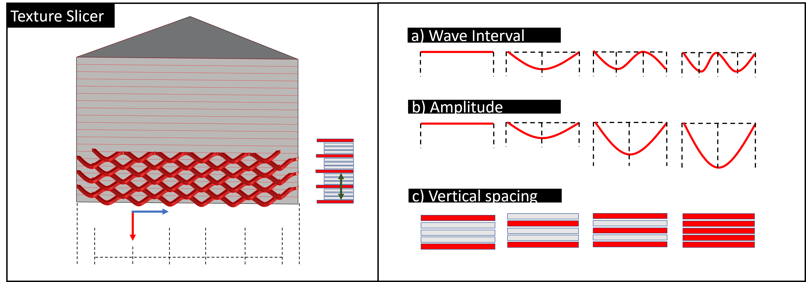

# Texture-Slicer: Decoupling Geometry from Surface-finish by Parameterizing Texture Directly in G-code for FDM Printing

A repository for Texture-Slicer tool for computational texture generation for geometries in Rhino3D. This tool was build in Grasshopper. Texture-Slicer can be used with provided UI. 

## How to use

Choose a geometry (brep) and adjust roughness parameters (interval, amplitude, vertical spacing, as on picture below) to change the texture pattern and roughness. 
Top view preview of texture diagram is provided.

Go to second tab to change printer settings (layer height, nozzle size, wall count, base layers, temperature) and save the file.

## Sample use

Refer to the video. 

